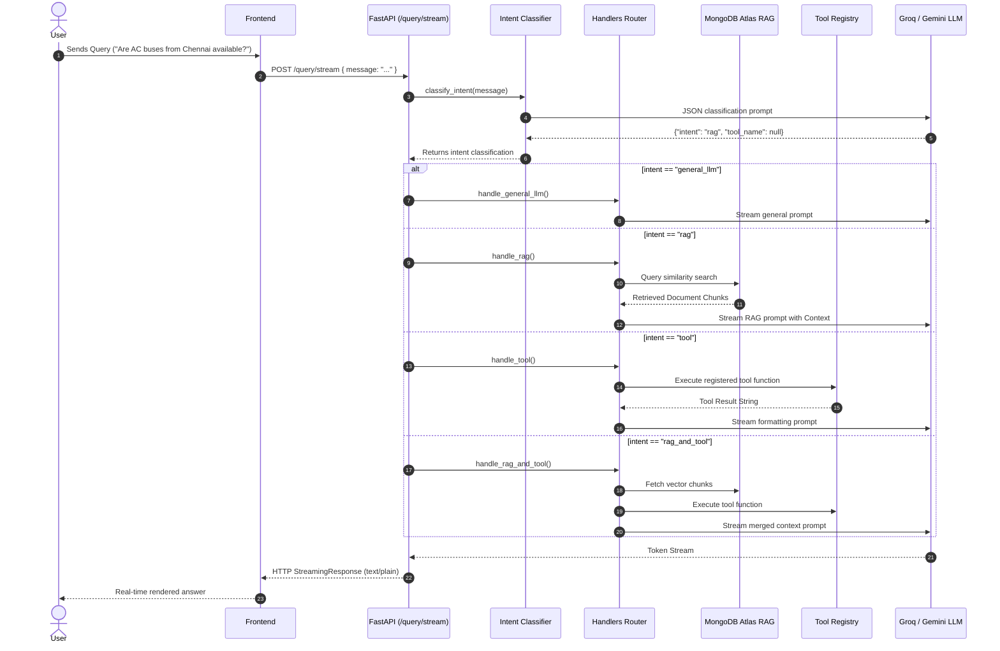

# Comprehensive Technical Analysis: Trase Bus Travel API Backend

## 1. System Architecture Overview

The **Trase Bus Travel API Backend** is an intelligent, agentic Retrieval-Augmented Generation (RAG) and query routing system built with **FastAPI**, **LangChain**, **MongoDB Atlas**, **Google Gemini**, and **Groq**.

### Key System Capabilities
1. **Intelligent Intent-Based Router**: Classifies incoming user queries into specific execution modes (`general_llm`, `rag`, `tool`, `rag_and_tool`).
2. **Incremental Vector Indexing**: Automatically monitors document changes on startup, tracking file hashes in MongoDB to ingest only new/modified files while pruning removed documents.
3. **Streaming Token Delivery**: Emits real-time SSE / plain-text token streams to the frontend via FastAPI `StreamingResponse`.
4. **Hybrid Vector Search & Fallback**: Performs vector search on MongoDB Atlas with in-memory cosine similarity fallback.

---

## 2. Technology Stack & Key Dependencies

| Component | Technology / Library | Role / Description |
| :--- | :--- | :--- |
| **API Framework** | `FastAPI`, `Uvicorn` | Asynchronous web framework & ASGI web server providing streaming endpoints and lifecycle hooks. |
| **LLM Integration** | `ChatGroq`, `ChatGoogleGenerativeAI` | Flexible LLM provider (`llama-3.3-70b-versatile` via Groq or `gemini-1.5-flash` via Google). |
| **Embeddings** | `GoogleGenerativeAIEmbeddings` | Generates 768-dimensional text embeddings using `models/embedding-001`. |
| **Vector Store** | `langchain-mongodb` (`MongoDBAtlasVectorSearch`) | Stores embedded document chunks and performs vector similarity search. |
| **Database** | `pymongo` (MongoDB Atlas) | Houses two collections: `bus_routes_v2` (chunks & vectors) and `file_registry` (hash state tracking). |
| **Document Loaders** | `pypdf`, `CSVLoader`, `TextLoader`, `UnstructuredWordDocumentLoader` | Handles parsing for `.csv`, `.pdf`, `.txt`, `.docx` files. |
| **Text Chunking** | `RecursiveCharacterTextSplitter` | Splits document text into overlapping chunks (e.g. 800 chars with 100 overlap). |

---

## 3. Directory & Module Structure

```
backend/
├── server.py                   # Uvicorn entry point (port 8000, hot-reload)
├── requirements.txt            # System dependencies
├── app/
│   ├── main.py                 # FastAPI application setup, CORS, lifespan startup sync
│   ├── core/
│   │   └── config.py           # Pydantic environment configuration (API keys, Mongo URLs)
│   ├── rag/                    # RAG Pipeline & Indexing
│   │   ├── build_index.py      # Startup file scanner & incremental ingester
│   │   ├── chunker.py          # Document text chunking logic
│   │   ├── file_registry.py    # Database registry tracking file MD5 hashes
│   │   ├── lc_vectorstore.py   # Vector store initialization
│   │   ├── loader.py           # Document parsing for multi-format files
│   │   └── retriever.py        # Vector retriever with fallback search
│   ├── router/                 # Query Routing & Agentic Execution
│   │   ├── intent_classifier.py# LLM query intent classifier with keyword fallback
│   │   ├── tool_registry.py    # Registry for registered computational tools
│   │   └── handlers.py         # 4 Streaming response handlers
│   ├── routes/                 # FastAPI API Endpoints
│   │   ├── query.py            # Primary router endpoint (/query/stream)
│   │   └── chatbot.py          # Legacy RAG-only endpoint (/chatbot/stream)
│   ├── prompts/                # Prompt Engineering Templates
│   │   ├── system_prompt.py    # Base personality prompt for Trase
│   │   ├── general_prompt.py   # Small-talk prompt
│   │   └── rag_prompt.py       # Context-aware RAG prompt
│   └── utils/
│       └── lc_llm.py           # Centralized LLM factory
```

---

## 4. Detailed Component Breakdown

### A. Server & Startup (`server.py` & `app/main.py`)
- **Lifecycle Hook (`lifespan`)**: Triggered when Uvicorn boots. Calls `check_and_update_index()` before accepting incoming requests.
- **Middleware**: Configured with CORS allowing origins (`*`) for local React development.

### B. Incremental Indexing Engine (`app/rag/`)
- **`build_index.py`**:
  - Scans `data/raw/` recursively.
  - Compares MD5 checksums of files against MongoDB `file_registry`.
  - Atomically ingest new files or re-ingests modified files (pruning old chunks first).
  - Deletes orphaned vector chunks when files are deleted from disk.
- **`file_registry.py`**: Manages `{filename, file_hash, chunk_count, ingested_at}` records in MongoDB.
- **`retriever.py`**: Queries MongoDB Atlas Vector Search. If vector search fails or index is missing, executes a fallback in-memory cosine similarity algorithm over document embeddings.

### C. Query Router & Handlers (`app/router/`)
- **Intent Classifier (`intent_classifier.py`)**:
  Classifies incoming user prompts into one of 4 modes:
  1. `general_llm`: Greetings, compliments, general conversation.
  2. `rag`: Specific bus route, schedule, fare, or timing questions requiring vector search context.
  3. `tool`: Calculation/action queries requiring specific backend tools.
  4. `rag_and_tool`: Complex queries requiring both retrieved vector context AND computational tool output.
- **Handlers (`handlers.py`)**:
  - Generator functions yielding text tokens for real-time streaming output.
  - Pipe components using LangChain Expression Language (LCEL): `Prompt | LLM | StrOutputParser()`.

---

## 5. End-to-End Execution Workflow

### Request Lifecycle Diagram


